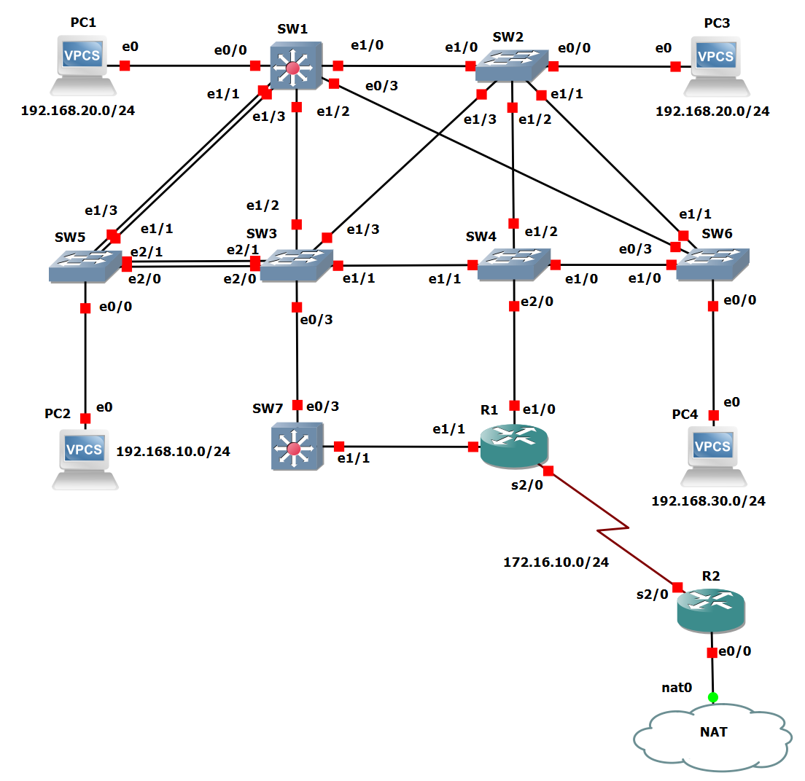

# Layer 2 Resilience and Optimization using Spanning Tree Protocol

This repository documents a GNS3 lab project focused on the implementation and manipulation of Spanning Tree Protocol (STP) to build a resilient, loop-free Layer 2 network. The project also integrates essential switching and routing concepts, including VLANs, EtherChannel, inter-VLAN routing, and NAT.

## Project Overview

In switched networks with redundant physical paths, switching loops are a critical issue. They can cause broadcast storms and MAC table instability, degrading network performance to the point of unavailability. This project directly addresses this challenge by using STP to manage the logical topology. It works by blocking redundant ports to create a single active path, while keeping alternate paths in standby for automatic failover.

## Network Topology



## Key Technologies and Concepts

*   **Switching (Layer 2):**
    *   **Spanning Tree Protocol (STP):** Manipulation of the Root Bridge election process through priority adjustments and path cost tuning for traffic engineering.
    *   **VLANs:** Network segmentation using VLANs 10, 20, 30 (Data) and 99 (Native/Management).
    *   **EtherChannel (LACP):** Aggregation of two links between SW3 and SW5 to increase bandwidth and provide link redundancy.
    *   **VTP (VLAN Trunking Protocol):** Used to propagate VLAN configuration from SW5 (the VTP server) to other switches.

*   **Routing (Layer 3):**
    *   **Inter-VLAN Routing:** 'Router-on-a-stick' configuration on R1 to enable communication between different VLANs.
    *   **Dynamic Routing Protocol:** RIPv2 implemented for route sharing between R1, R2, and L3-capable switches.
    *   **Routed Links:** A point-to-point Layer 3 link configured between SW7 and R1.
    *   **NAT (Network Address Translation):** NAT Overload (PAT) configured on R2 to allow the internal private network to access the simulated internet.

*   **Network Services:**
    *   **DHCP Server:** Configured on SW1 to provide dynamic IP addressing for clients in VLANs 10, 20, and 30.
    *   **DNS:** R1 is configured to forward DNS queries to R2, which acts as the resolver for the network.

## Configuration Highlights

### Spanning Tree Protocol (STP) Manipulation

The primary objective was to deterministically control which switch became the Root Bridge and to define the primary traffic paths. The switch priorities were manually configured to enforce a specific election outcome:

1.  **SW5 (Priority 8192) - Designated Root Bridge**
2.  SW1 (Priority 16384)
3.  SW3 (Priority 24576)
4.  SW7 (Priority 32768)
5.  SW2 (Priority 40960)
6.  SW4 (Priority 49152)


Below is the sample configuration from SW5, forcing it to become the Root Bridge for all VLANs:
```cisco
configure terminal
spanning-tree 1, 10, 20, 30, 99 priority 8192
```

### EtherChannel (LACP) Configuration

To aggregate the links between SW3 and SW5, a Port-Channel was configured using LACP (`mode active`), a vendor-neutral link aggregation protocol.

```cisco
! Configuration on SW5
interface range e2/0 - 1
  channel-group 1 mode active

! Configuration on SW3
interface range e2/0 - 1
  channel-group 1 mode active
```
This configuration results in a single logical link with double the bandwidth and built-in redundancy, as traffic automatically fails over if one of the physical links goes down.

## Device Configurations

The full running configurations for each device can be found in the `config` directory:

*   [`config\SW1`](configs/SW1-Config.txt)
*   [`config\SW2`](configs/SW2-Config.txt)
*   [`config\SW2`](configs/SW3-Config.txt)
*   [`config\SW2`](configs/SW4-Config.txt)
*   [`config\SW2`](configs/SW5-Config.txt)
*   [`config\SW2`](configs/SW6-Config.txt)
*   [`config\SW2`](configs/SW7-Config.txt)
*   [`config\SW2`](configs/R1-Config.txt)
*   [`config\SW2`](configs/R2-Config.txt)

## Conclusion and Validation

This lab successfully demonstrated the implementation of a redundant, stable, and predictable network. Loops were effectively prevented by STP, and end-to-end connectivity tests (e.g., `ping google.pt` from PC1) confirmed that inter-VLAN routing, DHCP, DNS, and NAT were all functioning correctly in unison. This project solidified my practical understanding of resilient network design and advanced Layer 2/3 implementation.
